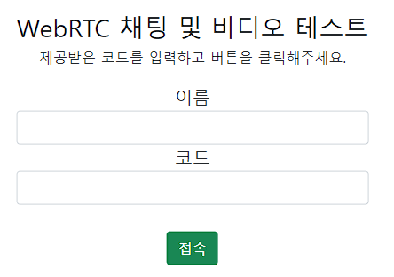
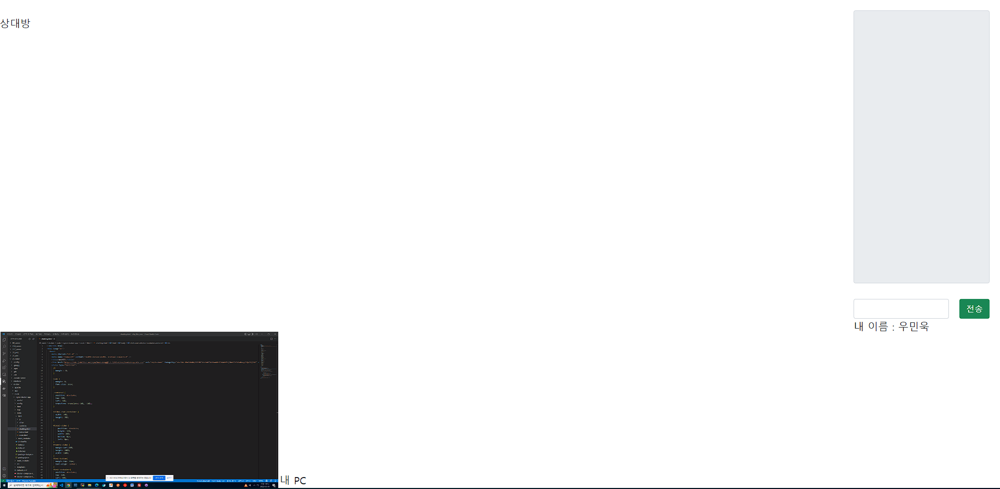
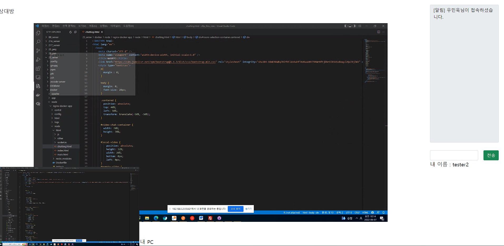

- 👋 안녕하세요. 저는 우민욱입니다.
- 👀 저는 웹 프로그래밍에 흥미가 있습니다.
- 🌱 HTML, CSS, JAVASCRIPT, PHP를 통해 개발을 공부하고 페이지를 개발하였습니다.
- 📫 제 이메일은 minwook_94@naver.com이고 전화번호는 010-7929-9275입니다.

github은 아직 페이지 구성 및 테스트 페이지 출력 구성중에 있습니다.

## webRTC TEST Example

1. 접속을 위한 페이지입니다.

 
2. 코드에 처음 접속했을 때의 페이지입니다.

 
3. 코드를 입력하고 들어온 페이지에 먼저 들어온 사람이 있을 때의 페이지입니다.

 
- 서로 페이지를 통해 채팅 및 화면 공유가 가능한 페이지입니다.
- 또한 웹캠 등을 통한 카메라 공유 또한 개발을 통해 가능합니다.