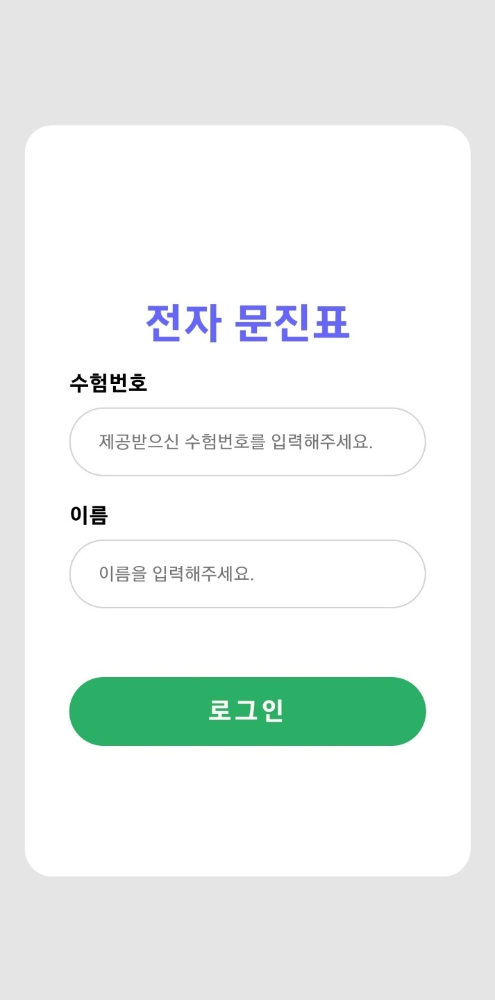
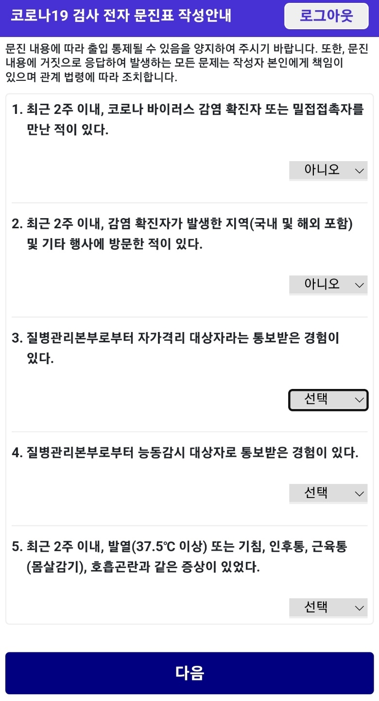
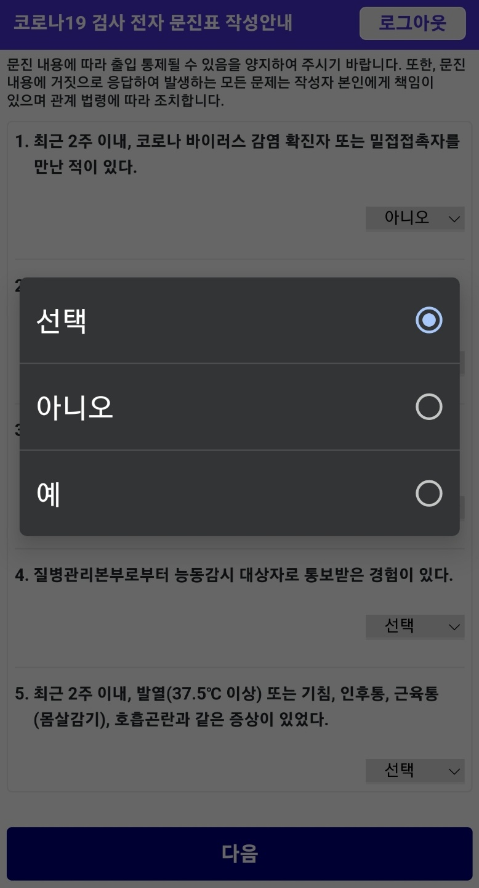
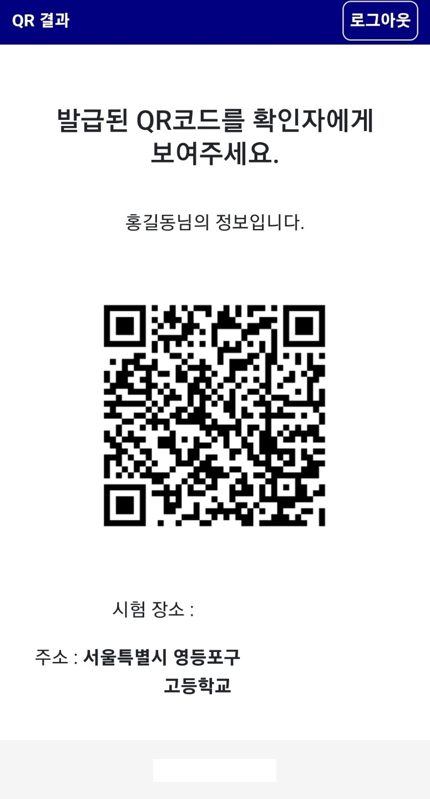
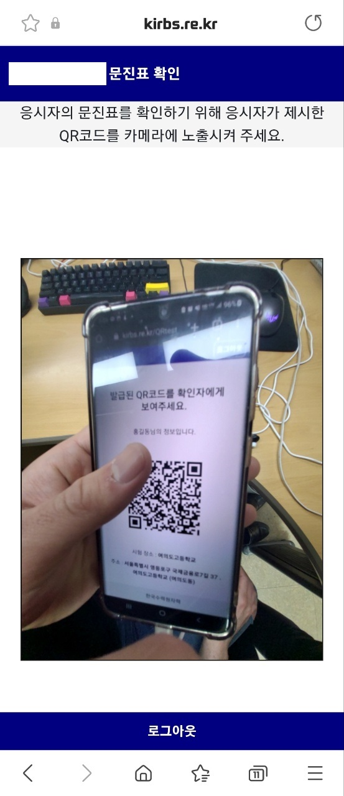
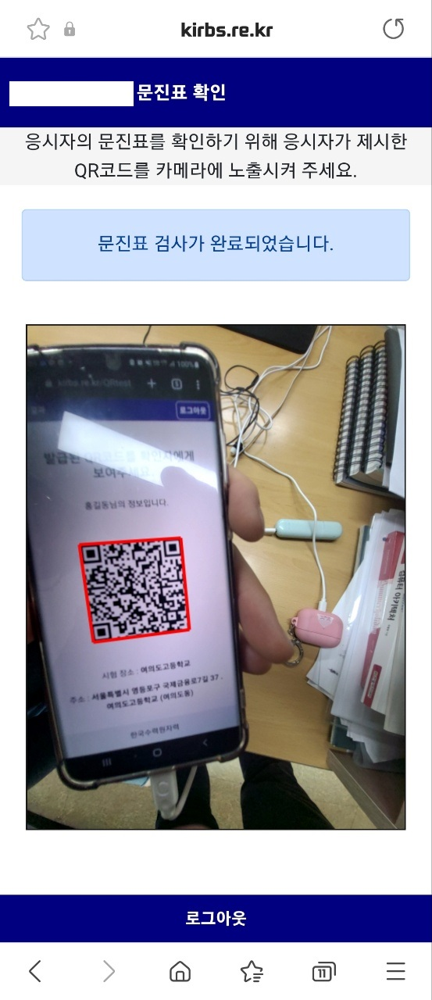
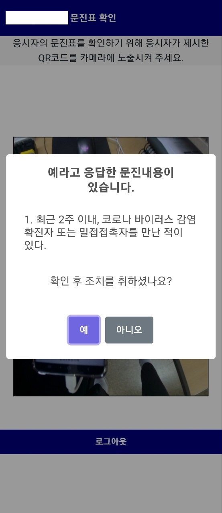
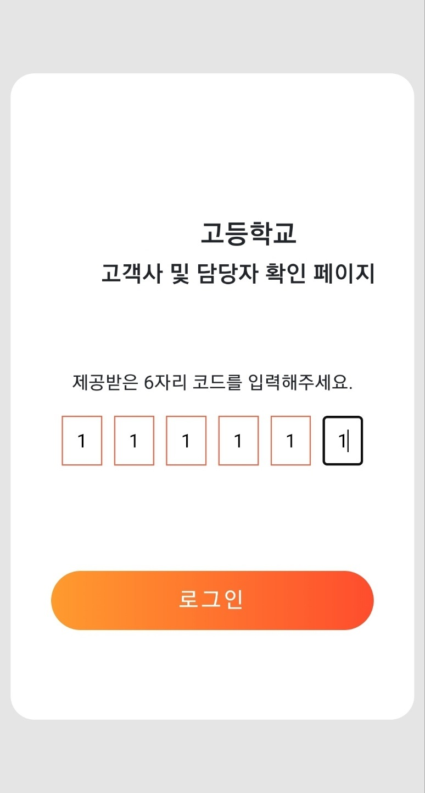
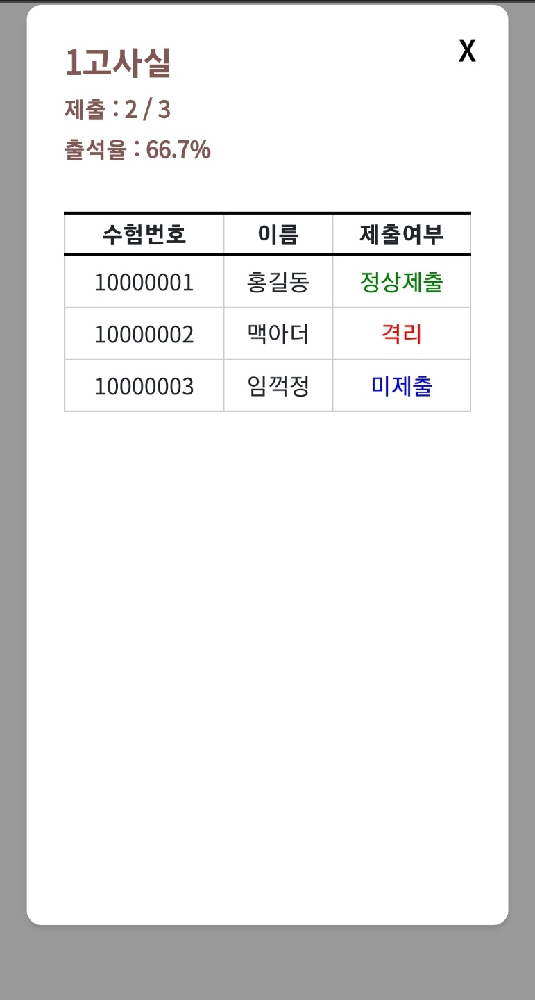

## 전자 문진표 프로젝트

### 개발 환경
- OS : Linux
- DB : MySQL
- Server : Apache
- Language : PHP, HTML, CSS, JavaScript

### 개발 기간
- 약 2개월

### 개발 인원
- 2명

### 개발 내용
- 응시자의 코로나 관련 정보를 수집받아 관리자가 확인할 수 있는 웹 페이지 제작
- 응시자의 코로나 관련 정보를 QR코드로 생성하여 관리자가 스캔하여 정보를 입력할 수 있도록 함
- 특성 상 웹 페이지는 PC 및 모바일 환경에서 모두 접속 가능하도록 제작

### 개발 내용 상세

#### 1. 응시자는 제공받은 수험번호와 이름으로 로그인을 진행한 후 코로나 관련 개인정보 수집 및 이용 동의서를 작성

#### 1-1 동의서에 동의를 진행하고 서명을 받도록 제공

#### 1-2 서명을 완료하면 응시자의 개인정보를 입력받아 DB에 저장 후 QR코드 발급

#### 2. 관리자는 응시자의 문진표를 확인할 수 있는 웹 페이지를 제공

#### 2-1. 문진 결과에 따라 조치를 취하게 할 수 있도록 안내문 제공

#### 3. 최종적으로 오프라인 시험에서 입실을 한 사람들을 확인할 수 있는 웹 페이지 제공

