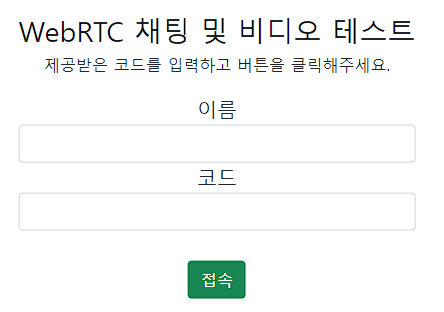
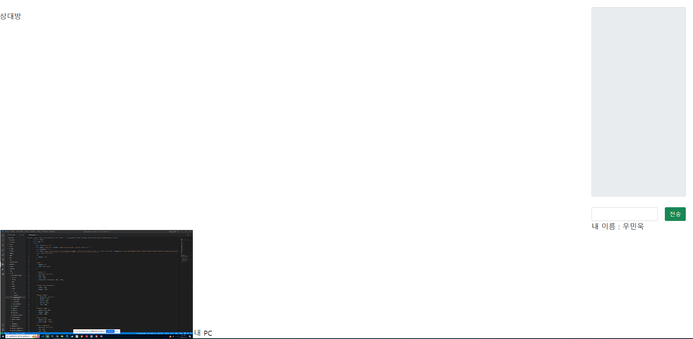
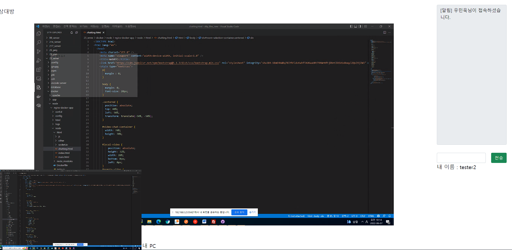

## webRTC TEST Example

개발 환경 
- Node.js를 통한 개발
- Centos 7

1. 접속을 위한 페이지입니다.

 
2. 코드에 처음 접속했을 때의 페이지입니다.

 
3. 코드를 입력하고 들어온 페이지에 먼저 들어온 사람이 있을 때의 페이지입니다.

 

- 서로 페이지를 통해 채팅 및 화면 공유가 가능한 페이지입니다.
- 또한 웹캠 등을 통한 카메라 공유 또한 코드 을 통해 가능합니다.
